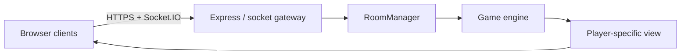

# Sala13

Sala13 is a self-hosted, browser-based multiplayer game room designed as a
school project. One Windows or Linux machine runs the Node.js server; players
join from phones or computers through the same URL. The server owns rooms,
turns, decks, hidden information, scores and win conditions.

The repository is a production-minded starter, not a claim that thirteen large
games are already finished. The platform kernel, responsive interface, public
and private lobbies, dynamic Info modal and a complete server-authoritative
Tic-Tac-Toe vertical slice are implemented. The other twelve game engines have
detailed state/action blueprints ready for incremental development.

## What works now

- responsive dashboard containing all 13 requested game entries;
- live public lobby list and private rooms reachable by code;
- optional private-room password stored as a salted `scrypt` digest;
- game-specific minimum/maximum player limits;
- stable browser player id, 30-second reconnect grace and host transfer;
- automatic deletion of empty and stale rooms;
- per-player room projections, action versioning and socket rate limiting;
- working two-player Tic-Tac-Toe with server-side turn/win/draw validation;
- Info button on game cards and in the bottom-right of every room;
- short and deep rules plus generated SVG examples for every game;
- Windows, Raspberry Pi, Docker, systemd, Nginx and Tailscale instructions;
- automated tests and a GitHub Actions workflow.

## Quick start

Requirements: Node.js 24 LTS and npm. Node 22 LTS also works; Node 20 is no
longer supported upstream and should not be used for a new deployment.

```bash
git clone <your-repository-url>
cd sala13
cp .env.example .env
npm ci
npm start
```

Open `http://localhost:3000`. A second device on the same LAN can use
`http://SERVER_LAN_IP:3000`, provided the operating-system firewall allows TCP
port 3000.

Windows PowerShell equivalent:

```powershell
Copy-Item .env.example .env
npm ci
npm start
```

Development mode restarts the server when backend files change:

```bash
npm run dev
```

## Repository map

```text
sala13/
├── apps/
│   ├── server/
│   │   ├── src/
│   │   │   ├── games/       # engine contract, Tris, card/canvas templates
│   │   │   ├── realtime/    # schemas and Socket.IO event gateway
│   │   │   ├── rooms/       # Room + RoomManager lifecycle
│   │   │   ├── security/    # per-socket abuse limiter
│   │   │   └── index.js
│   │   └── test/
│   └── web/public/
│       ├── js/components/    # Info modal and SVG examples
│       ├── js/games/         # browser renderers; never canonical rules
│       ├── index.html
│       └── styles.css
├── packages/shared/src/     # game catalogue, events, default categories
├── deploy/                  # systemd and Nginx templates
├── docs/                    # architecture, game plans, deployment, roadmap
├── Dockerfile
├── compose.yaml
└── package.json             # npm workspaces
```

## Core commands

| Command | Purpose |
| --- | --- |
| `npm start` | Run the HTTP and WebSocket server |
| `npm run dev` | Run with Node watch mode |
| `npm test` | Run all domain tests |
| `npm run check` | Parse-check critical server modules |
| `docker compose up -d --build` | Run the ARM64/x64 container |

## Architecture at a glance



Clients send intent (`place cell 4`, `draw`, `fold`) rather than a resulting
state. Each room serializes actions, checks the expected version, lets its
engine validate the intent and then emits a different safe projection to each
player. This is the key boundary that prevents a browser from choosing its own
cards, score or winning result.

Read the complete design before adding a new engine:

- [Architecture and WebSocket protocol](docs/ARCHITECTURE.md)
- [Blueprints for all 13 games](docs/GAME_BLUEPRINTS.md)
- [Raspberry Pi, Windows and Tailscale deployment](docs/DEPLOYMENT.md)
- [Incremental roadmap](docs/ROADMAP.md)

## Environment variables

Copy `.env.example` to `.env`. Do not commit `.env`.

| Variable | Default | Meaning |
| --- | ---: | --- |
| `HOST` | `0.0.0.0` | Interfaces on which Node listens |
| `PORT` | `3000` | HTTP and WebSocket port |
| `ALLOWED_ORIGINS` | empty | Comma-separated browser origins; set in production |
| `DISCONNECT_GRACE_MS` | `30000` | Time allowed to reconnect |
| `EMPTY_ROOM_TTL_MS` | `30000` | Delay before deleting an empty disconnected room |
| `STALE_ROOM_TTL_MS` | `21600000` | Maximum inactive room age |
| `SOCKET_RATE_WINDOW_MS` | `10000` | Socket limiter window |
| `SOCKET_RATE_MAX_EVENTS` | `80` | Accepted events per socket/window |

## Project status and recommended next engine

Start with Connect Four. It reuses the same two-player lobby as Tic-Tac-Toe but
adds gravity and directional line checking without hidden information. Then add
Battleship to exercise player-specific views, followed by one card game to test
secure shuffling and private hands. Poker and Burraco should be last because
their betting/meld edge cases are substantially larger than the UI suggests.

## Responsible deployment

For classmates on different networks, use Tailscale first. It avoids exposing a
home router port to the whole internet and supplies encrypted connectivity. A
public IP or tunnel should only be added after origin allow-listing, HTTPS,
rate limits, monitoring and an explicit decision about who may join.

## Licence

MIT for source code. Card artwork is not bundled; any future Neapolitan assets
must have their own redistribution licence and attribution.
