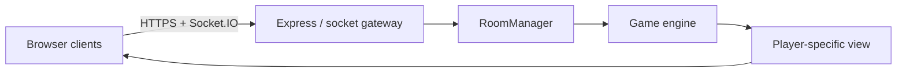

# Sala13

Sala13 is a self-hosted, browser-based multiplayer game room designed as a
school project. One Windows or Linux machine runs the Node.js server; players
join from phones or computers through the same URL. The server owns rooms,
turns, decks, hidden information, scores and win conditions.

Version 0.3 contains a playable, server-authoritative core for every game plus
the complete visual-table pass: local illustrated card decks, game-specific
surfaces, explicit action consoles, responsive scoreboards and clearer result
feedback. Advanced tournament variants, moderation, persistence and exhaustive
edge-case certification remain future hardening work; this is still a school
project, not a real-money or production gambling service.

## What works now

- responsive dashboard containing all 13 requested game entries;
- live public lobby list and private rooms reachable by code;
- optional private-room password stored as a salted `scrypt` digest;
- game-specific limits up to 40 players, with exact-count games kept strict;
- stable browser player id, 30-second reconnect grace and host transfer;
- automatic deletion of empty and stale rooms;
- per-player room projections, action versioning and socket rate limiting;
- playable engines and browser controls for all 13 modes;
- local 52-card SVG deck and authentic public-domain Neapolitan card images;
- table-specific layouts, separate leaderboards, chip trays and result panels;
- Blackjack bets, hit/stand, split, double, dealer resolution and chips;
- Uno action cards, wild colors, optional stacking and server-private hands;
- Scopa/Briscola Italian-deck rules, teams, captures, tricks and scoring;
- Hold'em blinds, betting streets, all-ins, side pots and seven-card evaluator;
- Burraco draw/meld/discard loop, pozzetti and clean/dirty burraco scoring;
- Battleship secret placement, Chess/Checkers validation, Categories voting,
  Hangman, Connect Four and both drawing rotations;
- typo-tolerant drawing guesses with explicit system feedback and undo;
- Info button on game cards and in the bottom-right of every room;
- short and deep rules plus generated SVG examples for every game;
- Windows, Raspberry Pi, Docker, systemd, Nginx and Tailscale instructions;
- automated tests and a GitHub Actions workflow.

## Quick start

Requirements: Node.js 24 LTS and npm. Node 22 LTS also works; Node 20 is no
longer supported upstream and should not be used for a new deployment.

```bash
git clone <your-repository-url>
cd sala13
cp .env.example .env
npm ci
npm start
```

The terminal prints every usable address. `http://localhost:3000` works only on
the server computer. A second device on the same LAN must use the address of the
computer running `npm start`, for example `http://192.168.1.42:3000` — never the
guest device's own IP. Socket.IO always follows that same browser origin.

Windows PowerShell equivalent:

```powershell
Copy-Item .env.example .env
npm ci
npm start
```

On Windows, open PowerShell as Administrator once and allow LAN traffic on the
Private network profile:

```powershell
npm run setup:lan:windows
```

This creates only an inbound TCP rule for port 3000 and prints the URLs that
other devices can open. Devices on different networks still need Tailscale,
ZeroTier, a reverse proxy or another explicitly configured tunnel.

Sala13 also works when opened from a plain HTTP LAN address. Player and drawing
IDs do not rely on secure-context-only browser APIs. On every page entry, a
Telefono/Computer chooser applies the matching touch targets, table flow and
leaderboard layout; the choice can be reopened from the header.

Development mode restarts the server when backend files change:

```bash
npm run dev
```

## Repository map

```text
sala13/
├── apps/
│   ├── server/
│   │   ├── src/
│   │   │   ├── games/       # authoritative engines for every game
│   │   │   ├── realtime/    # schemas and Socket.IO event gateway
│   │   │   ├── rooms/       # Room + RoomManager lifecycle
│   │   │   ├── security/    # per-socket abuse limiter
│   │   │   └── index.js
│   │   └── test/
│   └── web/public/
│       ├── assets/cards/     # vendored French and Neapolitan artwork
│       ├── js/components/    # Info modal and visual examples
│       ├── js/games/         # visual tables; never canonical rules
│       ├── index.html
│       ├── styles.css
│       └── game-tables.css
├── packages/shared/src/     # game catalogue, events, default categories
├── deploy/                  # systemd and Nginx templates
├── docs/                    # architecture, game plans, deployment, roadmap
├── Dockerfile
├── compose.yaml
└── package.json             # npm workspaces
```

## Core commands

| Command | Purpose |
| --- | --- |
| `npm start` | Run the HTTP and WebSocket server |
| `npm run dev` | Run with Node watch mode |
| `npm test` | Run all domain tests |
| `npm run check` | Parse-check critical server modules |
| `docker compose up -d --build` | Run the ARM64/x64 container |

## Architecture at a glance



Clients send intent (`place cell 4`, `draw`, `fold`) rather than a resulting
state. Each room serializes actions, checks the expected version, lets its
engine validate the intent and then emits a different safe projection to each
player. This is the key boundary that prevents a browser from choosing its own
cards, score or winning result.

Read the complete design before adding a new engine:

- [Architecture and WebSocket protocol](docs/ARCHITECTURE.md)
- [Blueprints for all 13 games](docs/GAME_BLUEPRINTS.md)
- [Raspberry Pi, Windows and Tailscale deployment](docs/DEPLOYMENT.md)
- [Incremental roadmap](docs/ROADMAP.md)

## Environment variables

Copy `.env.example` to `.env`. Do not commit `.env`.

| Variable | Default | Meaning |
| --- | ---: | --- |
| `HOST` | `0.0.0.0` | Interfaces on which Node listens |
| `PORT` | `3000` | HTTP and WebSocket port |
| `ALLOWED_ORIGINS` | empty | Comma-separated browser origins; set in production |
| `DISCONNECT_GRACE_MS` | `30000` | Time allowed to reconnect |
| `EMPTY_ROOM_TTL_MS` | `30000` | Delay before deleting an empty disconnected room |
| `STALE_ROOM_TTL_MS` | `21600000` | Maximum inactive room age |
| `SOCKET_RATE_WINDOW_MS` | `10000` | Socket limiter window |
| `SOCKET_RATE_MAX_EVENTS` | `80` | Accepted events per socket/window |

## Current hardening priorities

The next work is not another placeholder engine. It is deeper verification:
long randomized card-conservation runs, full chess/perpetual-draw fixtures,
rare poker all-in/reopen combinations, Burraco house-rule variants, drawing
moderation, persistent accounts/results and load tests on the target Pi.

## Responsible deployment

For classmates on different networks, use Tailscale first. It avoids exposing a
home router port to the whole internet and supplies encrypted connectivity. A
public IP or tunnel should only be added after origin allow-listing, HTTPS,
rate limits, monitoring and an explicit decision about who may join.

## Licence

MIT for source code. Card artwork is not bundled; any future Neapolitan assets
must have their own redistribution licence and attribution.
