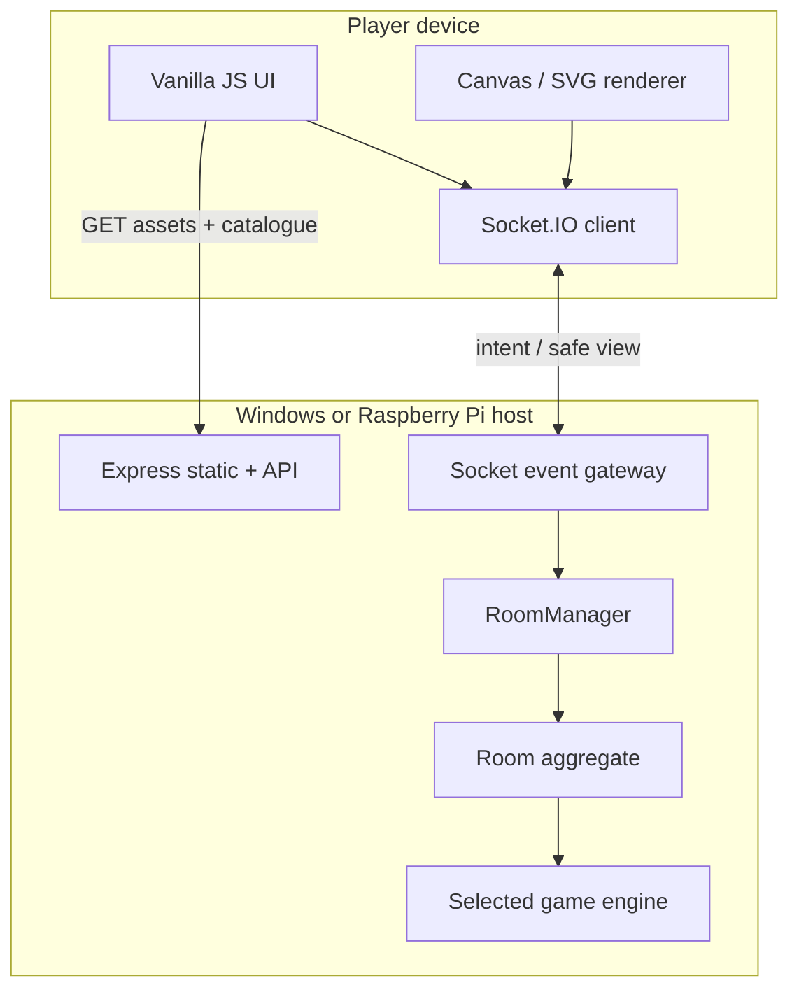
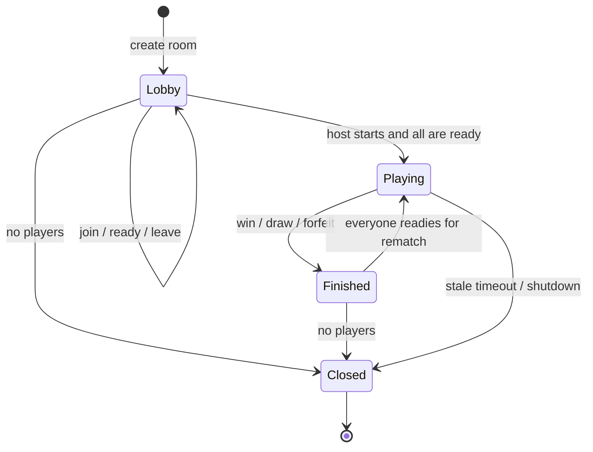
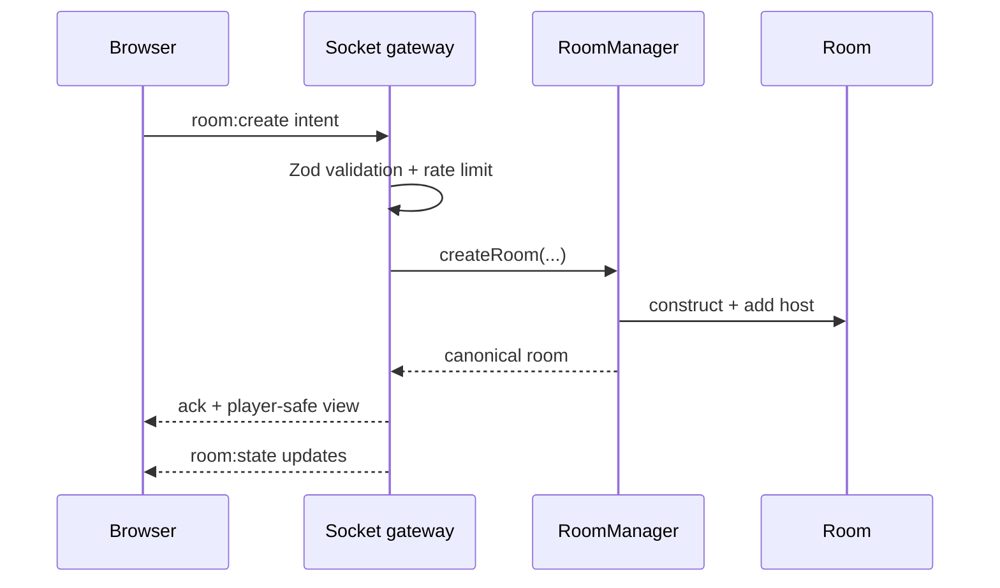

# Sala13 architecture

## 1. Scope and architectural stance

Sala13 is a modular monolith. One Node.js process serves the static browser
application, a small read-only HTTP API and Socket.IO. This is simpler to run on
Windows and Raspberry Pi than separate services, while keeping boundaries clear
enough to split later.

The current persistence model is deliberately in-memory:

- a server restart closes every room;
- there are no accounts, durable rankings or payments;
- one process is the source of truth;
- the design targets a classroom/friends deployment, not an anonymous global
  gaming service.

This is an appropriate first milestone. Adding Redis, SQLite or authentication
before game rules are stable would introduce operational work without making
the core state machines more correct.

## 2. Runtime topology



The key rule is one-way authority: the browser asks, the room validates, the
engine changes canonical state, and the server publishes a safe view.

## 3. Module boundaries

| Module | Owns | Must not own |
| --- | --- | --- |
| `packages/shared` | stable ids, event names, public catalogue, static categories | private game state or Node-only secrets |
| `realtime` | schema validation, acknowledgement format, socket membership wiring | game rules |
| `rooms` | room lifecycle, players, host, readiness, versions, serialization | card ranking or board movement |
| `games` | legal actions, randomization, scoring, completion, private projections | sockets or DOM rendering |
| `web/js/games` | controls, animation and rendering of a received view | legality, scores or deck order |
| deployment files | process supervision, proxying, TLS/network boundary | application authorization |

Keeping the game engine independent of Socket.IO makes it possible to test a
complete game with plain objects and later run bots or replay logs without a
browser.

## 4. Room aggregate

The `Room` class is the consistency boundary. Conceptually it contains:

```ts
type Room = {
  code: string;                    // six unambiguous random characters
  gameId: string;
  visibility: "public" | "private";
  passwordDigest: string | null;   // never returned to clients
  settings: Readonly<GameSettings>;
  hostPlayerId: string;
  status: "lobby" | "playing" | "finished";
  players: Map<PlayerId, Player>;
  gameState: ServerOnlyState | null;
  version: number;
  createdAt: number;
  updatedAt: number;
};
```

A player id is a browser-generated UUID and a socket id is a temporary
transport address. Keeping them separate permits reconnection. For an internet
deployment, replace the plain UUID with a server-issued, signed reconnect token
stored in an `HttpOnly`, `Secure`, `SameSite` cookie.

### Lifecycle



When a socket drops, its player is marked disconnected and has a short grace
period. Rejoining with the same stable player id replaces the socket address.
After the grace expires the player is removed; the host role transfers to the
oldest remaining player. An active game currently becomes `finished` if a
player is removed. Individual engines may later define a more specific forfeit
result.

### Cleanup invariants

- private rooms never appear in `getPublicLobbies()`;
- a deleted room removes all socket-membership and timer entries;
- an empty room has an expiry timer even if disconnections were unclean;
- a periodic sweep removes inactive rooms that survived an unexpected path;
- timers are `unref()`'d so they do not stop a clean process shutdown.

## 5. WebSocket protocol

All mutating client events use Socket.IO acknowledgements. Success:

```json
{ "ok": true, "room": { "code": "K7M2QA", "version": 4 } }
```

Failure:

```json
{
  "ok": false,
  "error": {
    "code": "INVALID_ACTION",
    "message": "Non è il tuo turno."
  }
}
```

Never branch client behavior on localized message text; use `error.code`.

### Client to server

| Event | Essential payload | Server checks |
| --- | --- | --- |
| `lobby:list` | none | per-socket rate limit |
| `room:create` | player id/name, game id, visibility, optional password/settings | schema, known game, player bounds |
| `room:join` | player id/name, code, optional password | room exists, password, capacity, status |
| `room:leave` | none | socket membership |
| `room:ready` | `{ ready }` | membership and non-playing status |
| `room:start` | none | host, valid count, all connected/ready, implemented engine |
| `game:action` | `{ expectedVersion, action }` | membership, current version, game-specific action |

### Server to client

| Event | Payload | Visibility |
| --- | --- | --- |
| `lobby:snapshot` | array of minimal public-room summaries | every connected client |
| `room:state` | player-specific room projection | exactly one player/socket |
| `room:closed` | code and machine-readable reason | affected room members |
| `game:error` | public error code/message | requesting socket |
| `presence:update` | connected transport count | every connected client |

The starter sends a full room projection after a mutation. That is deliberate:
small game states are easier to recover and reason about than a patch stream.
For a large drawing canvas, use snapshot plus numbered operations as described
below.

### Create and join flow



## 6. Server-authoritative game design

### Authority matrix

| Concern | Client | Server |
| --- | --- | --- |
| button/animation state | owns | may provide hints |
| legal move | requests | decides |
| turn and timer deadline | displays | decides |
| deck creation/shuffle/deal | never | owns |
| private hand/prompt/ship grid | displays own projection | owns complete data |
| score and winner | renders | calculates |
| canvas pointer samples | captures | validates, orders, stores |
| chat/answer text | authors | bounds, normalizes, moderates |

Do not send an entire updated board or hand from a browser. A valid intent is
small and domain-specific:

```js
{ type: "place", cell: 4 }
{ type: "play-card", cardId: "red:skip", declaredColor: "green" }
{ type: "bet", amount: 40 }
{ type: "fire", row: 6, column: 3 }
```

The user can inspect and modify every browser variable. A disabled HTML button
is user experience, never security.

### Action serialization and stale clients

Node runs JavaScript on one event loop, but asynchronous handlers can still
interleave across awaits. Every room has a promise queue. `game:action` enters
that queue, compares `expectedVersion` with the canonical room version, applies
one transition, increments the version and only then starts the next action.

If two browser tabs submit version 18, exactly one may commit. The other gets
`STALE_STATE` and an immediate current projection. This also makes double-click
and retry behavior deterministic.

For high-latency actions that call external services, do not hold the room queue
open. Record an internal pending operation id, release the queue, do the work,
then enqueue a completion command whose preconditions are checked again.

### Cards and hidden information

`games/card-utils.js` contains an unbiased Fisher-Yates shuffle backed by
`crypto.randomInt`. A deck is created and shuffled only on the server. Every
card has a stable logical id; artwork filenames are never game data.

Canonical state may contain:

```js
{
  deck: [/* full ordered card objects */],
  hands: { playerA: [/* full cards */], playerB: [/* full cards */] },
  discard: [],
  currentPlayerId: "playerA"
}
```

The opponent projection must contain only counts:

```js
{
  hands: {
    playerA: [/* cards, only when requesting player is A */],
    playerB: { count: 7 }
  }
}
```

Never broadcast canonical state to a Socket.IO room and attempt to hide it in
CSS. The gateway iterates players and calls `engine.view(state, playerId)` for
each socket.

For auditable competitive randomness, a later version can add a commit/reveal
scheme: publish `SHA-256(serverSeed)` before play, combine it with player seeds,
then reveal the server seed after the hand. This permits verification without
letting a client choose the final shuffle.

### Shared canvas

Store drawing as normalized vector strokes, not a base64 bitmap per pointer
move. A stroke intent contains an id, tool, color, bounded brush size and 2–256
points with coordinates in `[0,1]`. `drawing-protocol.js` supplies the base
schema.

The drawing engine must additionally enforce:

1. sender is the active drawer for the current round;
2. monotonically increasing operation sequence;
3. per-player strokes/points per second budget;
4. maximum total points and strokes per round;
5. a server-selected color palette if arbitrary values are unnecessary;
6. eraser semantics represented as an operation, not client-side deletion of
   another accepted operation;
7. snapshot creation every N operations and at round end.

A reconnecting viewer receives `{ snapshot, snapshotSequence, operationsAfter
}`. The server still owns the word prompt and sends it only to the drawer.

### Timers

Browsers display timers using server-provided absolute timestamps:

```js
{ roundStartedAt: 1787600000000, roundEndsAt: 1787600090000 }
```

The animation may use `Date.now()` adjusted by a measured server offset, but
late/valid is decided when the command reaches the server. Add a small explicit
latency policy if fairness requires it; never trust a client-provided send time.

## 7. Game engine contract

Every engine implements four static methods:

```js
class ExampleEngine {
  static implemented = true;

  static start({ players, settings }) {
    return canonicalServerOnlyState;
  }

  static applyAction({ action, playerId, players, settings, state }) {
    validateEveryPrecondition();
    return nextCanonicalState;
  }

  static view(state, playerId) {
    return redactSecretsFor(playerId);
  }

  static isFinished(state) {
    return Boolean(state.result);
  }
}
```

`engine-contract.js` is the copyable skeleton. `tic-tac-toe-engine.js` is the
working reference. Keep transitions deterministic except for explicit server
randomness. Prefer returning a new state rather than mutating the previous one;
it simplifies tests, replay and debugging.

### Engine test matrix

For each engine, test at minimum:

- valid start at every supported player count;
- rejection below/above or between allowed counts;
- every legal action in every phase;
- action from wrong player, wrong phase or stale version;
- duplicate/replayed action;
- boundary cells, empty/full deck and insufficient chips/cards;
- hidden fields absent from every opponent/spectator view;
- all win, loss, draw and tie-break paths;
- player removal/reconnect/forfeit behavior;
- deterministic fixture or seeded randomness for complex deals.

## 8. Validation, security and abuse controls

Implemented in the starter:

- Zod schemas before room/domain calls;
- small HTTP JSON and Socket.IO payload limits;
- fixed-window per-socket event limiting;
- `helmet` security headers and a restrictive Content Security Policy;
- optional origin allow-list;
- `scrypt` with random salt and timing-safe password comparison;
- no room digest or canonical game state in client payloads;
- no `innerHTML` for player-controlled names;
- unambiguous random room codes;
- graceful shutdown and bounded lifecycle timers.

Still required before an untrusted public launch:

- server-issued signed sessions or real accounts;
- per-IP and per-account rate limits stored outside the process;
- moderation/report/kick/ban controls for text and drawings;
- audit logs that exclude secrets and personal content;
- CSRF-aware HTTP authentication if mutating REST endpoints are added;
- dependency and container scanning;
- backup/restore plan for future durable data;
- privacy notice and retention policy, especially for minors;
- load tests on the actual Raspberry Pi model.

### Password and room-code policy

Room passwords are optional and never displayed after creation. Room codes are
six characters from an alphabet that omits visually ambiguous symbols. Codes
have enough space for a small deployment but are still shareable invitations,
not long-term credentials. Rate-limit failed joins and consider expiry after
several failures if the service becomes public.

## 9. Persistence and horizontal scaling

### Stage A — current single process

Use in-memory `Map`s. This is fastest to develop and adequate for one supervised
server. Run exactly one Node process; a process manager must not use cluster
mode because each worker would see different rooms.

### Stage B — durable single host

Add SQLite in WAL mode for users, settings, completed scores and moderation
records. Keep active turn state in memory, periodically snapshot recoverable
games, and use transactions for balance/ranking changes. Do not write every
canvas point as an independent transaction.

### Stage C — multiple server instances

Only if measurements require it:

- Redis-backed Socket.IO adapter for cross-instance emits;
- sticky sessions while Socket.IO polling is enabled, or WebSocket-only clients
  after compatibility testing;
- central room ownership/locking or an actor per room;
- Redis rate limits and signed sessions;
- a durable database for identity/results;
- health/readiness probes and rolling-deployment draining.

The `Room` API should remain the domain boundary. Scaling is an infrastructure
change, not a reason to move validation into the client.

## 10. Observability

Use structured logs in production with fields such as `event`, `roomCodeHash`,
`gameId`, `version`, `durationMs` and `errorCode`. Do not log passwords, hands,
prompts, answer content or raw drawings. Hash or omit room codes if logs leave
the host.

Useful metrics:

- current sockets, rooms and players;
- create/join/action counts and failures by code;
- action validation latency per engine;
- disconnect/reconnect/forfeit rates;
- room lifetime and completed-game count;
- event-loop delay, memory and CPU;
- canvas points and outbound bytes per second.

`GET /api/health` currently provides a minimal liveness response. A future
readiness endpoint should verify required data stores without leaking details.

## 11. Adding a game without breaking the platform

1. Finalize rule variants and settings in `GAME_BLUEPRINTS.md`.
2. Create a pure engine and tests; do not touch sockets yet.
3. Add a player-safe `view()` and test secret redaction explicitly.
4. Register the engine in `game-registry.js`.
5. Add only the minimal new action shape to the socket schema, or give that
   engine its own strict action schema.
6. Build the browser renderer against saved fixture views.
7. Test with two real browsers, refresh one during play, throttle the network
   and double-click every action.
8. Test phone viewport and keyboard-only interaction.
9. Change catalogue status to `playable`.
10. Load-test on the intended host and document measured limits.

## 12. Decisions deliberately deferred

- accounts and profiles;
- spectators;
- global chat and voice;
- matchmaking/rankings;
- persistent replays;
- bots;
- localization beyond the current Italian copy;
- commercial card artwork;
- public anonymous hosting.

Deferring these keeps the school project focused on the difficult and reusable
part: correct real-time state machines.
